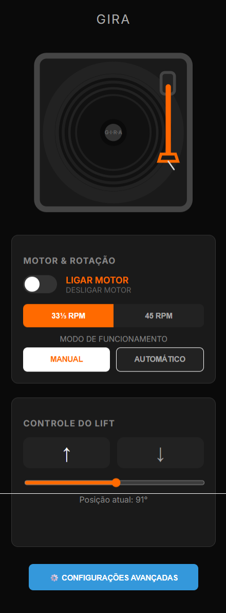
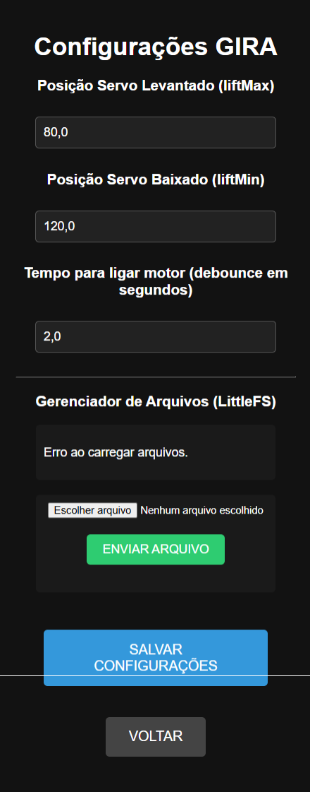

# Smart Record Player Firmware

*Read this in other languages: [Português](README.pt.md)*

This repository contains the firmware for a **Smart Record Player** project based on the ESP32-C3 microcontroller. It utilizes high-precision stepper motor control, advanced angular reading, and a web interface to provide an automated and modern experience for vinyl record playback.

## 📸 Web Interface Preview

  
  

## 🌟 Features and Functionalities

### 1. Precise and Silent Platter Control (TMC2209)
* **Microstepping and StealthChop2**: Uses the TMC2209 driver to control a stepper motor (e.g., NEMA17) ultra-silently and smoothly, minimizing resonance and ensuring high-fidelity audio.
* **RPM Adjustment**: Native support for 33 ⅓ RPM and 45 RPM, remotely configurable via the web panel, with accurate speed calculations sent via UART communication.
* **Acceleration Ramps**: Features smooth acceleration and deceleration to start and stop the platter rotation gently.

### 2. Tonearm Angular Reading
* **MT6701 Magnetic Sensor**: Performs absolute position and angle reading of the record player's tonearm using the I2C bus.
* **Automatic Detection**: Can identify initial movement and detect the end of a vinyl record based on the angle, triggering automatic motor stop.

### 3. Automatic Tonearm Lift
* **Integrated Servo Motor**: Actuates the tonearm lift mechanism, ensuring the stylus is lowered or raised with mechanical precision and safety.
* **Integrated Operation**: When moving the tonearm towards the platter, after a safe delay (programmable debounce), the motor turns on and the stylus descends smoothly. When the final limit of the record is detected, the stylus lifts and the rotation stops.

### 4. Web Interface and Monitoring
* **Web App (Internal Hosting)**: PWA application (HTML/JS/CSS) entirely stored on the microcontroller itself thanks to LittleFS.
* **Real-time WebSockets**: Continuous bidirectional telemetry communication, showing current speed, tonearm angle, and lift status on your browser or smartphone screen.
* **Control Modes**: Switch between **Automatic** or **Manual** mode without needing to change code.

### 5. Modern System and Connectivity
* **OTA (Over-The-Air)**: Ability to remotely update firmware over the Wi-Fi network, without needing a USB cable connected after the device is assembled.
* **Telnet Debug**: Embedded Telnet server on port 23 acting as a virtual serial monitor for practical diagnostics and tracking.
* **Data Persistence**: Fine settings like servo max/min limits and debounce time are permanently recorded in the NVS memory.

## 🛠️ Stack and Hardware
* **Microcontroller**: Seeed Studio XIAO ESP32C3
* **Motor Driver**: TMC2209 (Communicating via UART and Legacy mode)
* **Rotation Actuator**: NEMA17 Stepper Motor
* **Position Sensor**: MT6701 Magnetic
* **Lift Actuator**: Micro Servo
* **Framework**: PlatformIO with Arduino interface

## 📌 Pin Configuration (Pinout)
According to the project mapping:
* **TMC2209 (UART)**: `RX = Pin 5` / `TX = Pin 4` / `Enable = Pin 2`
* **Servo Motor**: `Pin 10`
* **MT6701 Sensor (I2C)**: `SDA = Pin 6` / `SCL = Pin 7`

## ⚙️ Installation and Deployment (PlatformIO)

1. Clone the repository and open the root folder in an IDE with PlatformIO (such as VS Code).
2. Optionally, fill in your default Wi-Fi credentials in `src/main.cpp`.
3. Make sure to run the **Upload Filesystem Image** task (in the PlatformIO menu) to send the `data/` folder containing the web interface to the ESP32's LittleFS.
4. Run the **Build** and then **Upload** the application via cable.
5. Access the panel by the designated IP or through `http://tocadiscos.local` if mDNS is operational on your network.
